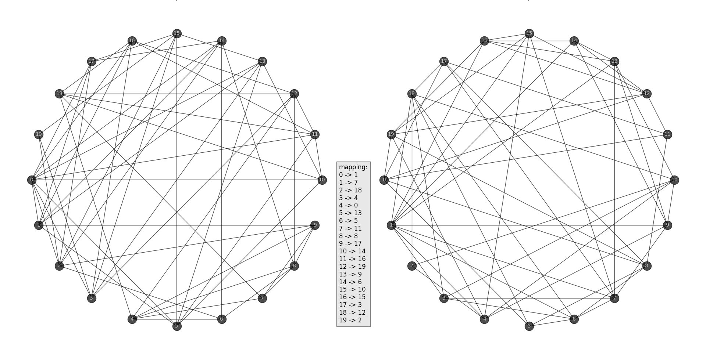

# Graphiso-Extractor

<div style="display:flex;justify-content: center;align-items: center;">

</div>

## Table of contents
- [Graphiso-Extractor](#graphiso-extractor)
  - [Table of contents](#table-of-contents)
    - [Introduction ](#introduction-)
    - [Prerequisite ](#prerequisite-)
    - [Database Description ](#database-description-)
    - [Instalation ](#instalation-)
    - [Structure ](#structure-)
    - [Examples of use ](#examples-of-use-)
      - [Determining isomorphism relation beteen graphs in python](#determining-isomorphism-relation-beteen-graphs-in-python)
      - [Determining sub-graph isomorphism relation between graphs in python](#determining-sub-graph-isomorphism-relation-between-graphs-in-python)
      - [Example drawing](#example-drawing)
    - [Summary ](#summary-)
    - [References ](#references-)

### Introduction <a name="intro"></a>

This project is intended for graph database extraction for further use with dedicated Python libraries for analysis Graph-Sub-Graph Isomorphism problem and general researches underlie the graph theory. It can be useful for scientific researches, learning graph theory and experiments conduction for scientist as well as science students. It can be used for testing your own improvements of existing graphs algorithms, writing your own and looking for dependencies in/between these beautiful structures.  

### Prerequisite <a name="prerequisite"></a>

Launching this application assume that you have installed on your computer a few required libraries and you use work station with Intel processor that support Math Kernel Library (MKL). In the parenthesis are provided recommended versions of those libraries on which project was tested.
- Armadillo Library (12.8.1)
- Boost Library (1.85.0)
- Intel MKL Library (2024.2)
- GNU (13.2.0)

### Database Description <a name="desc"></a>

You can read PDF article that is attached <a href="doc/papers/database.pdf"><b>here</b></a> in this project.

Thanks to effort of P. Foggia, C. Sansone, M. Vento I could renew the database
that was genereted synthetically and contains graphs of various sizes and characteristics.

Databse contains **72800** paris of graphs:

- **18200** - for for strict graph isomorphism 
- **54600** - for graph-sub-graph isomorphism

Below there there are listed types of the graphs in database:

- Randomly Connected Graphs with different values of the edge density &eta;
- Regular Meshes, with different dimensionality: 2D, 3D and 4D
- Irregular Meshes with different degrees of irregularity &rho;
- Bounded Valence Graphs, with valence equal to 3.6 and 9
- Irregular Bounded Valence Graphs with a degree of irregularity &alpha;

<br>

<table>
<tr>
  <th>Kind of Graph</th>
  <th>No. of Couples</th>
  <th>Parameters</th>
  <th>Size</th>
</tr>
<tr>
  <td rowspan=3>Randomly Connected Graphs (3000 couples)</td>
  <td>1000</td>
  <td>&eta; = 0.01</td>
  <td>From 20 to 1000</td>
</tr>
<tr>
  <td>1000</td>
  <td>&eta; = 0.05</td>
  <td>From 20 to 1000</td>
</tr>
<tr>
  <td>1000</td>
  <td>&eta; = 0.1</td>
  <td>From 20 to 1000</td>
</tr>
<tr>
  <td rowspan=3>Regular Mesh (2300 couples)</td>
  <td>1000</td>
  <td>2D-mesh</td>
  <td>From 16 to 1024</td>
</tr>
<tr>
  <td>800</td>
  <td>3D-mesh</td>
  <td>From 27 to 1000</td>
</tr>
<tr>
  <td>500</td>
  <td>4D-mesh</td>
  <td>From 16 to 1296</td>
</tr>
<tr>
  <td rowspan=3>Modified Mesh (6900 couples)</td>
  <td>3000</td>
  <td>Irregular 2D-mesh<br>
  &rho; &isin; {0.2, 0.4, 0.6}</td>
  <td>From 16 to 1024</td>
</tr>
<tr>
  <td>2400</td>
  <td>Irregular 3D-mesh<br>
  &rho; &isin; {0.2, 0.4, 0.6}</td>
  <td>From 27 to 1000</td>
</tr>
<tr>
  <td>1500</td>
  <td>Irregular 4D-mesh<br>
  &rho; &isin; {0.2, 0.4, 0.6}</td>
  <td>From 16 to 1296</td>
</tr>
<tr>
  <td rowspan=3>Bounded Valence Graphs (3000 couples)</td>
  <td>1000</td>
  <td>valence = 3</td>
  <td>From 20 to 1000</td>
</tr>
<tr>
  <td>1000</td>
  <td>valence = 6</td>
  <td>From 20 to 1000</td>
</tr>
<tr>
  <td>1000</td>
  <td>valence = 9</td>
  <td>From 20 to 1000</td>
</tr>
<tr>
  <td rowspan=3>Irregular Bounded Valence Graphs(3000 couples)</td>
  <td>1000</td>
  <td>valence = 3<br>
  &alpha; = 0.1</td>
  <td>From 20 to 1000</td>
</tr>  
<tr>
  <td>1000</td>
  <td>valence = 6<br>
  &alpha; = 0.1</td>
  <td>From 20 to 1000</td>
</tr>
<tr>
  <td>1000</td>
  <td>valence = 9<br>
  &alpha; = 0.1</td>
  <td>From 20 to 1000</td>
</tr>
</table>
The table above presents graphs generated for the isomorphism case.

### Instalation <a name="install"></a>

Before you run <b>install.bat</b> script make sure that you have MKL Library installed on your computer, Boost library built with MinGW and Aramdillo library.

Recommended installation paths are:

- Boost: ``C:/local/boost_1_85_0``
- Armadillo: ``C:/armadillo``
- MKL: default

If you want to customize installation paths - default installation process will failed. You will be forced to modify CMakeLists.txt file in order to amend proper information about location of the above mentioned tools on your computer.

Please familiar with official documentation for above mentioned tools and its installation processess.

After you will install all required tools download original files for databse that are base for conversion process from link <a href="https://drive.google.com/file/d/15rvTVlAcEbyQQkcanH-fQjmrCvQ5zhbv/view?usp=sharing"><b>Download resource</b></a>

At this stage we assume that you have all required tools installed and you physically have required files downloaded from above mentioned link.

Now you can do below steps:

1. Download the source code of this project
```powershell
git clone https://github.com/scitia/graphiso-extractor.git
```

2. Open <b>config.ini</b> file and fill all required iformation about source files location, target location and ground truth files location like in exmaple below:
```ini
[database]
source=c:/db/bin
ground=c:/db/gtr
target=c:/db/csv
```
For <b>source</b> and <b>ground</b> properties you have to point to /bin and /gtr directories respectively of downloaded database.

3. Run installation script:
```powershell
.\install.bat
```

You will be informed about every step of installation. After this process you will be in possession of converted database that you can use in high-level programming languages as python in more comfortable way. This usage will be described in the next section of this documentation.

### Structure <a name="structure"></a>

Generated database contains **.csv files** that represents graphs **adjacency matrices** in the **non compressed form**.

Generated resource contains 4 directories:

```bash
├── iso
├── si2
├── si4
└── si6
```

Each of them has the same structure as follows:

```bash
.
├── bvg
│   ├── b03
│   │   ├── m1000
│   │   ├── m200
│   │   ├── m400
│   │   ├── m600
│   │   ├── m800
│   │   ├── s100
│   │   ├── s20
│   │   ├── s40
│   │   ├── s60
│   │   └── s80
│   ├── b03m
│   │   ├── m1000
│   │   ├── m200
│   │   ├── m400
│   │   ├── m600
│   │   ├── m800
│   │   ├── s100
│   │   ├── s20
│   │   ├── s40
│   │   ├── s60
│   │   └── s80
│   ├── b06
│   │   ├── m1000
│   │   ├── m200
│   │   ├── m400
│   │   ├── m600
│   │   ├── m800
│   │   ├── s100
│   │   ├── s20
│   │   ├── s40
│   │   ├── s60
│   │   └── s80
│   ├── b06m
│   │   ├── m1000
│   │   ├── m200
│   │   ├── m400
│   │   ├── m600
│   │   ├── m800
│   │   ├── s100
│   │   ├── s20
│   │   ├── s40
│   │   ├── s60
│   │   └── s80
│   ├── b09
│   │   ├── m1000
│   │   ├── m200
│   │   ├── m400
│   │   ├── m600
│   │   ├── m800
│   │   ├── s100
│   │   ├── s20
│   │   ├── s40
│   │   ├── s60
│   │   └── s80
│   └── b09m
│       ├── m1000
│       ├── m200
│       ├── m400
│       ├── m600
│       ├── m800
│       ├── s100
│       ├── s20
│       ├── s40
│       ├── s60
│       └── s80
├── m2D
│   ├── m2D
│   │   ├── m1024
│   │   ├── m196
│   │   ├── m400
│   │   ├── m576
│   │   ├── m784
│   │   ├── s100
│   │   ├── s16
│   │   ├── s36
│   │   ├── s64
│   │   └── s81
│   ├── m2Dr2
│   │   ├── m1024
│   │   ├── m196
│   │   ├── m400
│   │   ├── m576
│   │   ├── m784
│   │   ├── s100
│   │   ├── s16
│   │   ├── s36
│   │   ├── s64
│   │   └── s81
│   ├── m2Dr4
│   │   ├── m1024
│   │   ├── m196
│   │   ├── m400
│   │   ├── m576
│   │   ├── m784
│   │   ├── s100
│   │   ├── s16
│   │   ├── s36
│   │   ├── s64
│   │   └── s81
│   └── m2Dr6
│       ├── m1024
│       ├── m196
│       ├── m400
│       ├── m576
│       ├── m784
│       ├── s100
│       ├── s16
│       ├── s36
│       ├── s64
│       └── s81
├── m3D
│   ├── m3D
│   │   ├── m1000
│   │   ├── m216
│   │   ├── m343
│   │   ├── m512
│   │   ├── m729
│   │   ├── s125
│   │   ├── s27
│   │   └── s64
│   ├── m3Dr2
│   │   ├── m1000
│   │   ├── m216
│   │   ├── m343
│   │   ├── m512
│   │   ├── m729
│   │   ├── s125
│   │   ├── s27
│   │   └── s64
│   ├── m3Dr4
│   │   ├── m1000
│   │   ├── m216
│   │   ├── m343
│   │   ├── m512
│   │   ├── m729
│   │   ├── s125
│   │   ├── s27
│   │   └── s64
│   └── m3Dr6
│       ├── m1000
│       ├── m216
│       ├── m343
│       ├── m512
│       ├── m729
│       ├── s125
│       ├── s27
│       └── s64
├── m4D
│   ├── m4D
│   │   ├── m1296
│   │   ├── m256
│   │   ├── m625
│   │   ├── s16
│   │   └── s81
│   ├── m4Dr2
│   │   ├── m1296
│   │   ├── m256
│   │   ├── m625
│   │   ├── s16
│   │   └── s81
│   ├── m4Dr4
│   │   ├── m1296
│   │   ├── m256
│   │   ├── m625
│   │   ├── s16
│   │   └── s81
│   └── m4Dr6
│       ├── m1296
│       ├── m256
│       ├── m625
│       ├── s16
│       └── s81
└── rand
    ├── r001
    │   ├── m1000
    │   ├── m200
    │   ├── m400
    │   ├── m600
    │   ├── m800
    │   ├── s100
    │   ├── s20
    │   ├── s40
    │   ├── s60
    │   └── s80
    ├── r005
    │   ├── m1000
    │   ├── m200
    │   ├── m400
    │   ├── m600
    │   ├── m800
    │   ├── s100
    │   ├── s20
    │   ├── s40
    │   ├── s60
    │   └── s80
    └── r01
        ├── m1000
        ├── m200
        ├── m400
        ├── m600
        ├── m800
        ├── s100
        ├── s20
        ├── s40
        ├── s60
        └── s80
```

Each leaf on above tree has 100 directires inside named 00-99 and evey of them has tree files:

```bash
.
├── ga.csv
├── gb.csv
└── gt.txt
```

where:

 - **ga.csv (Graph A)**
   - in sense of strict isomorphism is first graph of the pair.
   - in sense of graph-sub-graph isomorphism this graph represents the structure that in Graph B isomorphic structures will be searched for.
 - **gb.csv (Graph B)**
   - in sense of strict isomorphism is second graph of the pair.
   - in sense of graph-sub-graph isomorphism this graph contains &zeta; isomorphic structures towards A.
 - **gt.txt (Ground Truth)** 
   - contains single number that for isomorphism class of pairs is always 1, but in the sense of graph-sub-graph isomorphism problem represents the number of isomorhpic structures in graph B towards A.

### Examples of use <a name="use"></a>

#### Determining isomorphism relation beteen graphs in python

```python
f1n = 'ga.csv'
f2n = 'gb.csv'

mat_df_1 = pd.read_csv(f1n, sep=",", header=None)
G1 = nx.from_pandas_adjacency(mat_df_1)

mat_df_2 = pd.read_csv(f2n, sep=",", header=None)
G2 = nx.from_pandas_adjacency(mat_df_2)

GM = isomorphism.GraphMatcher(G1, G2)

print(f'Graphs {f1n} and {f2n} are isomorphic: ' + str(GM.is_isomorphic()))
```

#### Determining sub-graph isomorphism relation between graphs in python

```python
f1n = 'ga.csv'
f2n = 'gb.csv'

mat_df_1 = pd.read_csv(f1n, sep=",", header=None)
G1 = nx.from_pandas_adjacency(mat_df_1)

mat_df_2 = pd.read_csv(f2n, sep=",", header=None)
G2 = nx.from_pandas_adjacency(mat_df_2)

GM = isomorphism.GraphMatcher(G2, G1)

count_isomorphic_subgraphs = sum(1 for _ in GM.subgraph_isomorphisms_iter())

print(f"Actual number of isomorphic sub-graphs: {count_isomorphic_subgraphs}")
```

#### Example drawing

An example pair of two isomorphic graphs and vertex maping between them as a map container in center part of drawing:



I encourage you to use my dedicated python <a href="https://github.com/scitia/graphs"><b>library</b></a> to deal with graphs and automates processing these structures. <b style="color: #d12a2a">Use this installation only if you need to possess files locally on your computer to speed up processing in your researches.</b> 

### Summary <a name="summary"></a>

There are in plans to set up the FTP server to share all generated files. This documentation will be completed in the future.

### References <a name="references"></a>

Conrad Sanderson and Ryan Curtin.
<b><a href="https://arma.sourceforge.net/armadillo_joss_2016.pdf">Armadillo: a template-based C++ library for linear algebra.</a></b>
Journal of Open Source Software, Vol. 1, No. 2, pp. 26, 2016.

Conrad Sanderson and Ryan Curtin.
<b><a href="https://arma.sourceforge.net/armadillo_mca_2019.pdf">Practical Sparse Matrices in C++ with Hybrid Storage and Template-Based Expression Optimisation.</a></b>
Mathematical and Computational Applications, Vol. 24, No. 3, 2019.

P. Foggia, C. Sansone, M. Vento
<b>A Database of Graphs for Isomorphism and Sub-Graph
Isomorphism Benchmarking</b>
Dipartimento di Informatica e Sistemistica - Università di Napoli "Federico II" Via Claudio 21, I-80125 Napoli (Italy)

Cordella, L. P.; Foggia, P.; Sansone, C. Vento, M. (2001)
<b>An Improved Algorithm for Matching Large Graphs</b>
3rd IAPR-TC15 Workshop on Graph-based Representations in Pattern Recognition: 149–159.
